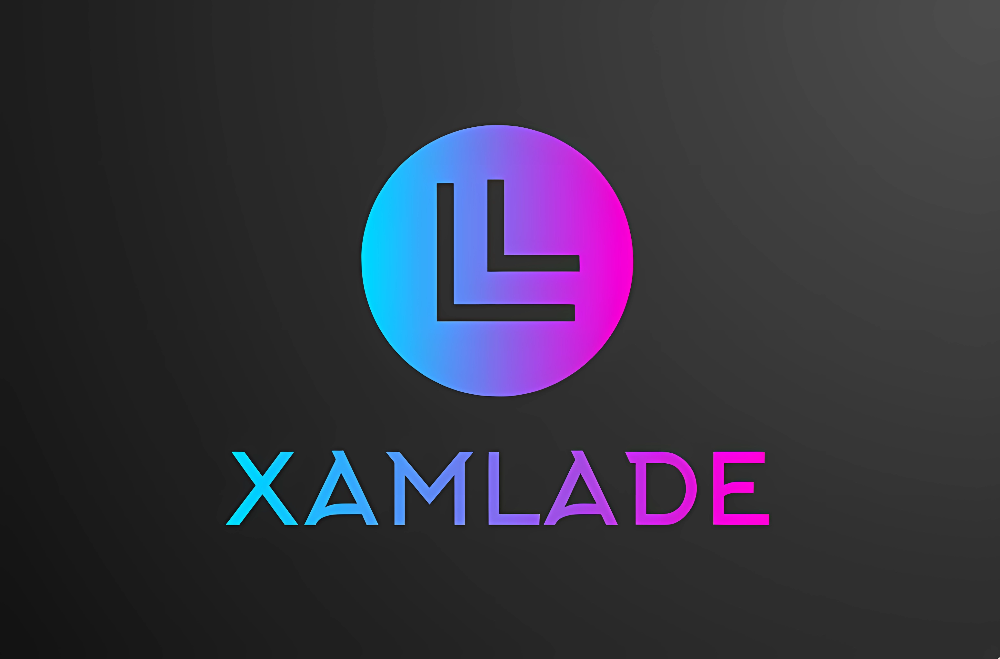

# Xamlade

# PLEASE CONTRIBUTE TO XAMLADE!!! (W_W)'
ak25800852@gmail.com
## The project is being developed by a single person who is very eager to help the community in creating a visual XAML editor.

### You can support the project by donating to the following wallets:
### BTC: 1LN9Cyk5BGZqvCnJ1sjQrZUsQYgZwfmEFH
### TON: UQAT4y-Y7cQutoMDsBcBvcS3H9S5vytslIdGLMZPhuS72y8R

## Визуальный редактор для XAML Avalonia UI 
### В разработке. Ориентировочный релиз осенью 2024. 

## RELEASE XX.10.2024

08.09.2024 проект не брошен.
Разработка идёт с затруднениями.
Неравнодушным предлагаю присоединиться или помочь материально.

#### На данный момент работает генерация XAML для некоторых базовых элементов, таких как кнопки, канвасы и прочее...
### XAML генерируется кнопкой XAMLize, выходной XAML лежит в XamladeDemo/MainWindow.axaml
Кнопкой Run Window можно скомпилировать выходной AXAML и проверить точность генерации

#### Частично работает deXAMLize (точно работает для XAML, сгенерированных этой программой)

Выделение многих объектов с зажатым Shift
Изменение масштаба элемента с зажатым Ctrl

Скриншоты ниже

Старые скриншоты

